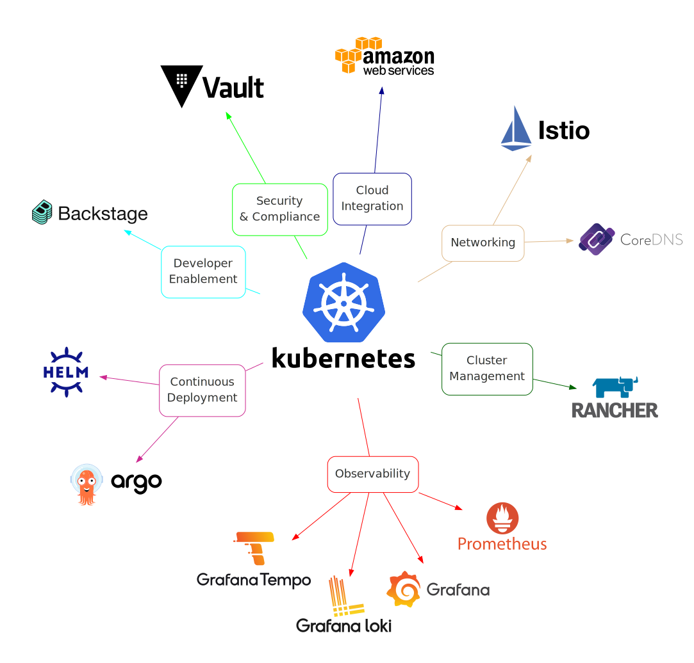

# Logo Diagram Generator 🎨


This package, `logo-diagram-generator`, allows you to generate SVG diagrams that visually represent a technology ecosystem, including tool logos, based on a YAML configuration file. It's designed to help visualize the relationships and categories of tools within a technology stack, making it easier to understand at a glance.

## Example Output

Here's an example of a diagram generated using `logo-diagram-generator`, based on an example configuration:

```
pip install logo-diagram-generator
logo-diagram-generator -c examples/full.example.yml -o examples -n full.example
```



## Quick Start

1. **Install the Package**

   Ensure you have Python and pip installed on your system. Install `logo-diagram-generator` from PyPI:

   ```bash
   pip install logo-diagram-generator
   ```

2. **Prepare Your Configuration**

   Create a `config.yml` file based on the provided `config.yml.example`. This file should list all the tools in your ecosystem, categorized appropriately. For example:

   ```yaml
   ecosystem:
     centralTool:
       name: Kubernetes
     groups:
       - category: Cluster Management
         tools:
           - name: Rancher
   ```

   If a tool has a different alias on VectorLogoZone or you want to download a logo from a specific URL, set the `alias` or `svgURL` value in the config respectively.

   See `config.yml.example` for more configuration examples!

3. **Download Logos and Generate Diagram**

   With your configuration ready, use the `logo-diagram-generator` CLI to download logos and generate your ecosystem diagram:

   ```bash
   logo-diagram-generator download-logos -c config.yml
   logo-diagram-generator generate -c config.yml
   ```

   This will download the necessary logos and produce an SVG file named `diagram_logos.svg` in your current directory.

   Both commands offer customization options for paths and output names, use `--help` to see all available CLI parameters.

## Customizing Your Diagram

- **Configuration File**: Modify `config.yml` to add, remove, or categorize tools as needed. Each tool can have a `name`, `label`, and optionally an `alias` or `svgURL` for custom logo URLs.
- **Logo Download**: If the automatic logo download doesn't find a logo for a tool, you can manually place an SVG file in the `logos` directory. The file name should match the tool's name in the configuration file.
- **Diagram Appearance**: The appearance of the generated diagram can be customized by modifying the `config.yml` file or by using different CLI options.

## Troubleshooting

- **Missing Logos**: Ensure all tools in your `config.yml` have either a valid `svgURL` or a corresponding SVG file in the `logos` directory.
- **CLI Errors**: Check the output of the CLI commands for any error messages. Most issues can be resolved by ensuring the configuration file is correctly formatted and all dependencies are installed.

## Contributing

Contributions to improve `logo-diagram-generator` or add new features are welcome. Please submit a pull request or open an issue to discuss your ideas.
